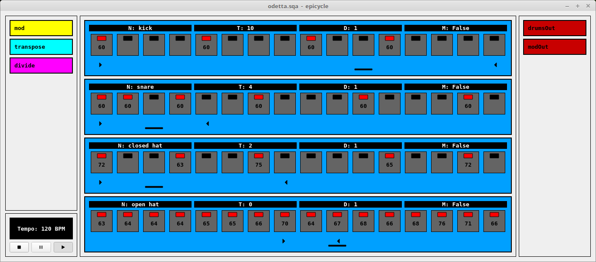

# epicycle

[](https://travis-ci.com/chronopoulos/epicycle)
[](https://www.gnu.org/licenses/gpl-3.0)

**epicycle** is a GUI sequencer based on [libsequoia](https://github.com/chronopoulos/libsequoia).



## Note
epicycle was developed as a personal testing and demonstration platform for
libsequoia. it was never intended to be released. as such, it's a bit rough
around the edges, with an obscure interface and zero documentation. but enough
people have asked for example code using libsequoia, that i've decided to
swallow my pride and publish it anyway. so just be aware: this is a half-baked
project.

## Dependencies
```
sudo apt-get install qt5-default g++
```
You'll also need libsequoia, which is hosted [here](https://github.com/chronopoulos/libsequoia)

## Build and Install
```
qmake
make
sudo make install
```

## Basic Usage
```
./bin/epicycle
```

N creates a new sequence  
P creates a new outport  
Q creates a new inport  
HJKL navigate around the steps  
T inserts (or removes) a trigger  
Ctrl-JK adjusts the note value  
Shift-N to set the sequence Name  
Shift-T to set the sequence Transpose  
Shift-D to set the sequence clock Divide  
Shift-M to Mute/unMute the sequence  
Spacebar to start/stop the sequence  

Right-click within the sequence to select the outport  
Right-click on the outport to set its name  
Right-click on the inport to set its various parameters  
First/Last step can be set by left/right-clicking under the steps  
